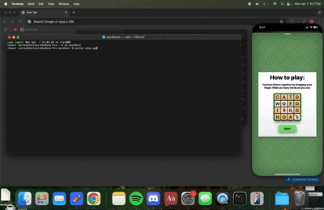
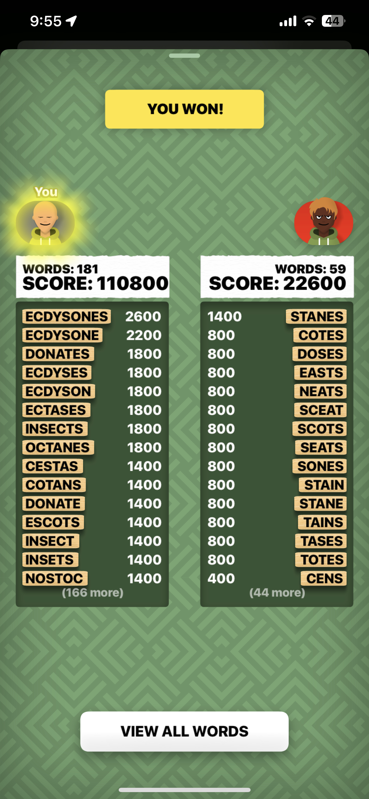
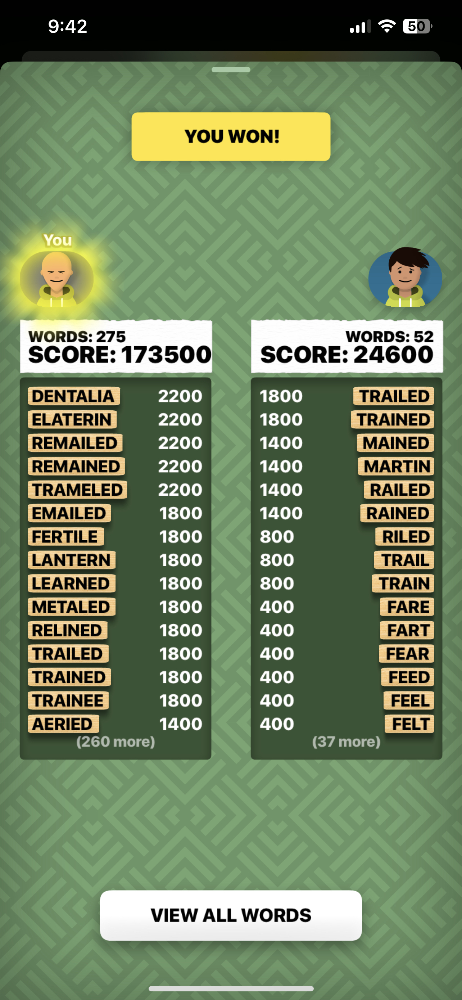

# WordHunt Bot

A full pipeline bot that uses computer vision, deep learning, and algorithmic pathfinding to autonomously play word hunt.

## Demo

<p align="center">
  
</p>
<p align="center">
  <em>The bot in action, from screen capture to solving.</em>
</p>
<p align="center">
  
  
</p>
<p align="center">
  <em>Final Game Results vs my friends</em>
</p>


##  How It Works

The bot executes a sequential pipeline to solve the game from screen to swipe:

1.  **Screen Capture**: Captures the game board area using `mss` for high speed image grabbing.
2.  **Tile Preprocessing**: Isolates and processes each letter tile from the screenshot using `OpenCV`.
3.  **Character Recognition (OCR)**: Feeds the cleaned tile images into a custom trained PyTorch CNN model to identify the letter on each tile.
4.  **Board Solving**: Passes the 2D character grid to a C++ backend via a `subprocess`. The C++ solver uses a Trie data structure and efficient graph traversal to find every valid word from a dictionary file.
5.  **Automated Swiping**: Uses `pynput` to simulate precise mouse drag paths for each found word, submitting the answers to the game automatically.

## Tech Stack

* **Python**: The core language for orchestration, automation, and model inference.
* **PyTorch**: Used for training and executing the CNN based OCR model.
* **OpenCV**: For all image preprocessing tasks
* **C++**: used for solving the board.
* **pynput**: To control mouse input for swiping words
* **mss**: Used for screen capture

##  How to Use

Only works for Mac + you need to use Iphone Mirroring

Copy and paste the following commands into the Terminal, one at a time, pressing **Enter** after each one.

1.  **Install C++ Compiler:**
    ```bash
    xcode-select --install
    ```
2.  **Download the Bot:**
    ```bash
    git clone https://github.com/Cardonbb/wordHunt.git
    ```

3.  **Go into the Bot's Folder:**
    ```bash
    cd wordHunt
    ```

4.  **Install the Python Packages:**
    ```bash
    pip3 install -r requirements.txt
    ```

## To run the Bot!

To run the bot make sure you are in the same Terminal window and use this command:

```bash
python play.py
```


Small problem is the start button click is hard coded so just click it if its not in the correct place.
